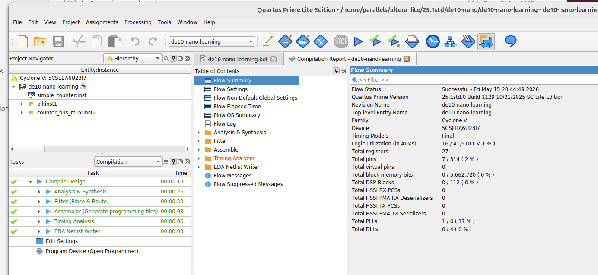

# Quartus Documentation

This folder is the source of truth for Quartus Prime Lite 25.1 setup and workflows on macOS + Parallels + Ubuntu + Rosetta.

## Contents

- [Playbook: Install Quartus on macOS](./playbook.md)
- [Markdown Style Guide](./markdown-style-guide.md)
- [Setup: macOS + Parallels + Ubuntu + Rosetta](./setup/macos-parallels-ubuntu-rosetta.md)
- [Setup: Quartus Lite 25.1 Install](./setup/quartus-lite-25.1-install.md)
- [Workflow: Build Flow](./workflows/build-flow.md)
- [Workflow: Program Flow](./workflows/program-flow.md)
- [Troubleshooting: Known Issues](./troubleshooting/known-issues.md)
- [Config: udev USB-Blaster Rules](./config/udev/51-usbblaster.rules)
- [Scripts: Bash](./scripts/bash/README.md)
- [Scripts: C](./scripts/c/README.md)

## Suggested Migration Plan

1. Move each current document section into the closest topic file above.
2. Move executable snippets into real files under `./scripts/bash` or `./scripts/c`.
3. Keep `.md` focused on context, assumptions, and usage.

## Setup Evidence

- [Quartus compile log screenshot](./assets/images/quartus_compile_log.png)

