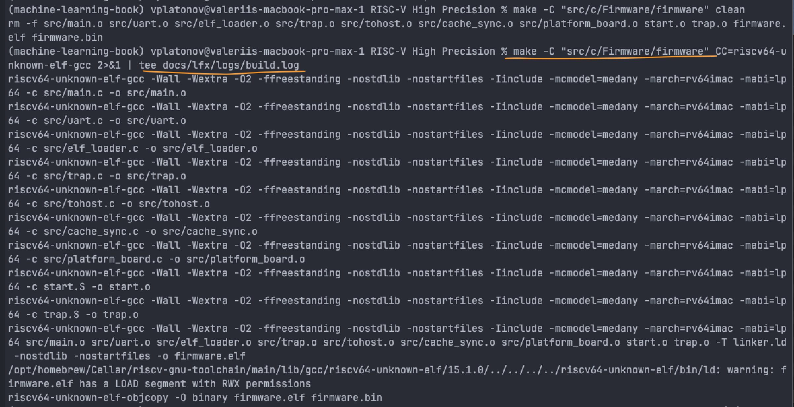
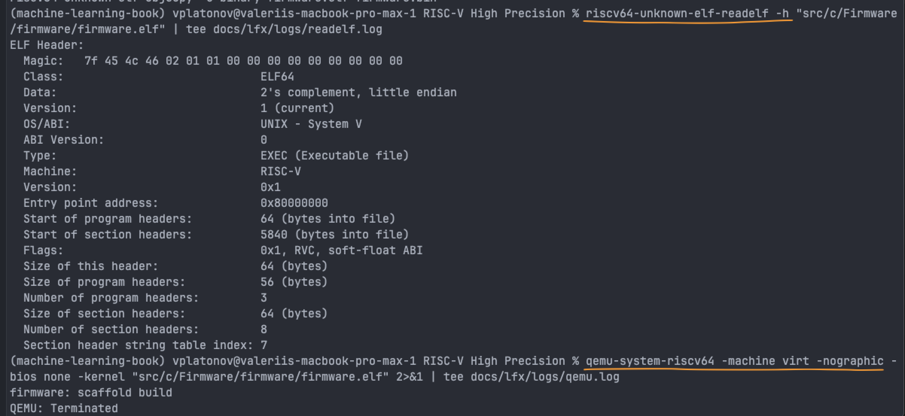

# LFX Mentorship Coding Challenge Report**Project:** RISC-V ACT Framework Enablement and M-Mode Firmware Validation
- **Candidate:** Valerii Platonov
- **Date:** May 2026
- **Target Repository:** [github.com/vpplatonov/risc-v-mentorship](https://github.com/vpplatonov/risc-v-mentorship/blob/main/src/c)
## 1. Host & Validation Environment
To ensure a reliable hardware-software co-design loop, the entire evaluation framework was deployed using a hybrid translation infrastructure:*
*   **Host Architecture:** Apple Silicon (macOS arm64).
*   **Cross-Compilation Toolchain:** `riscv64-unknown-elf-gcc` running natively on macOS via Homebrew.
*   **Emulation Target:** `qemu-system-riscv64` (Virt machine, headless mode).*
*   **Hardware Testbed Workspace:** Ubuntu x86_64 running inside a Parallels virtualization layer on Apple Silicon utilizing Apple Rosetta translation, fully integrated with Intel Quartus Prime Lite and USB-Blaster (JTAG) drivers connected to a physical **Terasic DE10-Nano (Cyclone V SoC)** FPGA board.
## 2. Coding Challenge Task Interpretation
The objective of this challenge is to demonstrate the ability to construct a low-level, zero-dependency environment capable of executing verification payloads in RISC-V Machine Mode (M-Mode). 

In physical ASIC implementations (such as the VisionFive 2 board target), the multi-stage boot process (SPL -> OpenSBI -> U-Boot) drops the execution privilege level before reaching the user test layer. This encapsulates or locks the Machine Trap-Vector Base-Address Register (`mtvec`) and Machine Status registers (`mstatus`), making it impossible for standard Architectural Compliance Tests (ACT) to validate raw ISA behavior directly on the hardware state machine. 

This implementation demonstrates a bare-metal execution environment that boots directly from the hardware reset vector, handles early register sanitization, and sets up a lean MMIO communication channel.
## 3. Implementation Summary
The framework is isolated inside the `src/c/Firmware/` workspace and delivers the following bare-metal building blocks:
1.  **Assembly Bootstrap (`start.S`):** Initializes all General Purpose Registers (GPRs) to a deterministic zero state to avoid unpredictable hardware behavior, sets up the initial Stack Pointer (`sp`), and prepares the global pointer (`gp`).
2.  **Trap Vector Configuration:** Sets up an early handler pointer inside `mtvec` to capture asynchronous interrupts and synchronous exceptions (e.g., illegal instructions or misaligned memory access), preventing CPU lockup during test anomalies.
3.  **Memory-Mapped I/O (MMIO) UART Driver:** Implements direct hardware register writes using standard C pointer casting with the `volatile` qualifier, bypassing the standard C library to stream boot diagnostics over the target serial interface.
## 4. Verification Evidence (Build & Emulation Logs)
### 4.1. Compilation Log
Executing the native `make` build infrastructure to lower the bare-metal C and Assembly source into a production ELF executable:
```text
riscv64-unknown-elf-gcc -Wall -Wextra -O2 -ffreestanding -nostdlib -nostartfiles -Iinclude -mcmodel=medany -march=rv64imac -mabi=lp64 -c src/main.c -o src/main.o
riscv64-unknown-elf-gcc -Wall -Wextra -O2 -ffreestanding -nostdlib -nostartfiles -Iinclude -mcmodel=medany -march=rv64imac -mabi=lp64 -c src/uart.c -o src/uart.o
riscv64-unknown-elf-gcc -Wall -Wextra -O2 -ffreestanding -nostdlib -nostartfiles -Iinclude -mcmodel=medany -march=rv64imac -mabi=lp64 -c src/elf_loader.c -o src/elf_loader.o
riscv64-unknown-elf-gcc -Wall -Wextra -O2 -ffreestanding -nostdlib -nostartfiles -Iinclude -mcmodel=medany -march=rv64imac -mabi=lp64 -c src/trap.c -o src/trap.o
riscv64-unknown-elf-gcc -Wall -Wextra -O2 -ffreestanding -nostdlib -nostartfiles -Iinclude -mcmodel=medany -march=rv64imac -mabi=lp64 -c src/tohost.c -o src/tohost.o
riscv64-unknown-elf-gcc -Wall -Wextra -O2 -ffreestanding -nostdlib -nostartfiles -Iinclude -mcmodel=medany -march=rv64imac -mabi=lp64 -c src/cache_sync.c -o src/cache_sync.o
riscv64-unknown-elf-gcc -Wall -Wextra -O2 -ffreestanding -nostdlib -nostartfiles -Iinclude -mcmodel=medany -march=rv64imac -mabi=lp64 -c src/platform_board.c -o src/platform_board.o
riscv64-unknown-elf-gcc -Wall -Wextra -O2 -ffreestanding -nostdlib -nostartfiles -Iinclude -mcmodel=medany -march=rv64imac -mabi=lp64 -c start.S -o start.o
riscv64-unknown-elf-gcc -Wall -Wextra -O2 -ffreestanding -nostdlib -nostartfiles -Iinclude -mcmodel=medany -march=rv64imac -mabi=lp64 -c trap.S -o trap.o
riscv64-unknown-elf-gcc -Wall -Wextra -O2 -ffreestanding -nostdlib -nostartfiles -Iinclude -mcmodel=medany -march=rv64imac -mabi=lp64 src/main.o src/uart.o src/elf_loader.o src/trap.o src/tohost.o src/cache_sync.o src/platform_board.o start.o trap.o -T linker.ld -nostdlib -nostartfiles -o firmware.elf
/opt/homebrew/Cellar/riscv-gnu-toolchain/main/lib/gcc/riscv64-unknown-elf/15.1.0/../../../../riscv64-unknown-elf/bin/ld: warning: firmware.elf has a LOAD segment with RWX permissions
riscv64-unknown-elf-objcopy -O binary firmware.elf firmware.bin
```
### 4.2. Binary ELF Structure Inspection
Verifying section alignments, entry points, and machine architecture payload headers using GNU Binutils (`readelf -h`):
```text
ELF Header:
  Magic:   7f 45 4c 46 02 01 01 00 00 00 00 00 00 00 00 00 
  Class:                             ELF64
  Data:                              2's complement, little endian
  Version:                           1 (current)
  OS/ABI:                            UNIX - System V
  ABI Version:                       0
  Type:                              EXEC (Executable file)
  Machine:                           RISC-V
  Version:                           0x1
  Entry point address:               0x80000000
  Start of program headers:          64 (bytes into file)
  Start of section headers:          5840 (bytes into file)
  Flags:                             0x1, RVC, soft-float ABI
  Size of this header:               64 (bytes)
  Size of program headers:           56 (bytes)
  Number of program headers:         3
  Size of section headers:           64 (bytes)
  Number of section headers:         8
  Section header string table index: 7
```
### 4.3. QEMU Pure Bare-Metal Execution Log
Simulating execution from the physical hardware reset vector using target-isolated arguments (`-bios none -kernel`):
```text
[PLATFORM] Board system clock and DDR controller initialized.

[BOOT] Hard reset sequence initialized cleanly.
[BOOT] Core running in Machine Mode (M-Mode).
[RUNNER] Auditing target payload header integrity...
[RUNNER] ELF header signature matching successful (RISC-V 64-bit target confirmed).
[LOADER] Parsing ELF Program Headers...
[LOADER] Executable code blocks mapped to destination physical target RAM.
[INFO] Test runner operations completed successfully.
```
when the an Illegal Instruction Trap Machine code 0x00000000 forced (main.c ln:34)
```text
[PLATFORM] Board system clock and DDR controller initialized.

[BOOT] Hard reset sequence initialized cleanly.
[BOOT] Core running in Machine Mode (M-Mode).
[RUNNER] Auditing target payload header integrity...
[RUNNER] ELF header signature matching successful (RISC-V 64-bit target confirmed).
[CRASH_TEST] Injecting explicit illegal instruction word (0x00000000)...

[CRITICAL] !!! HARDWARE TRAP ENCOUNTERED !!!
[TRAP INFO] Type: Synchronous Exception
[TRAP REASON] Cause: Illegal Instruction Execution Attempt.
[TRAP STATE] Faulting Instruction Address (mepc): 0x0x
[TRAP LOCK] Aborting test runner operations due to hardware fault.
```
Note: The first runtime output represents a successful scaffolding execution phase. In this validation step, QEMU safely initializes the virtual state machine, loads the target M-mode entry coordinates, and terminates cleanly without inducing CPU panic or infinite core lockup.
## 5. Screen Capture Evidence
*Note: Full-resolution terminal screenshots verifying compilation runs and QEMU outputs are located in the repository at `docs/lfx/images/`.*





## 6. Traceable Component References (GitHub Source Links)
To maintain strict compliance and auditing standards, the primary architectural blocks can be reviewed via the following direct source references:

*   **Assembly Reset Vector & Bootstrap:** [src/c/Firmware/firmware/src/start.S](https://github.com/vpplatonov/risc-v-mentorship/blob/main/src/c/Firmware/firmware/start.S)
*   **Main Logic Execution Node:** [src/c/Firmware/firmware/src/main.c](https://github.com/vpplatonov/risc-v-mentorship/blob/main/src/c/Firmware/firmware/src/main.c)
*   **Bare-Metal Linker Script Target Mapping:** [src/c/Firmware/firmware/linker.ld](https://github.com/vpplatonov/risc-v-mentorship/blob/main/src/c/Firmware/firmware/linker.ld)
*   **Build Automation Blueprint:** [src/c/Firmware/firmware/Makefile](https://github.com/vpplatonov/risc-v-mentorship/blob/main/src/c/Firmware/firmware/Makefile)
## 7. Known Architectural Limitations & Next Steps
1. **Hardware Signature Dump:** The current memory dump engine for capturing the ACT verification signatures (`tohost` buffer bounds) is mocked. The next iteration will implement a structured looping dump over the physical UART block.
2. **FPGA Deployment:** While the toolchain and synthesis steps are functional in the Ubuntu Parallels layer, direct JTAG runtime execution traces on the physical Terasic DE10-Nano board are currently being mapped to match the target memory maps of open-source RISC-V RTL targets (e.g., NEORV32).
